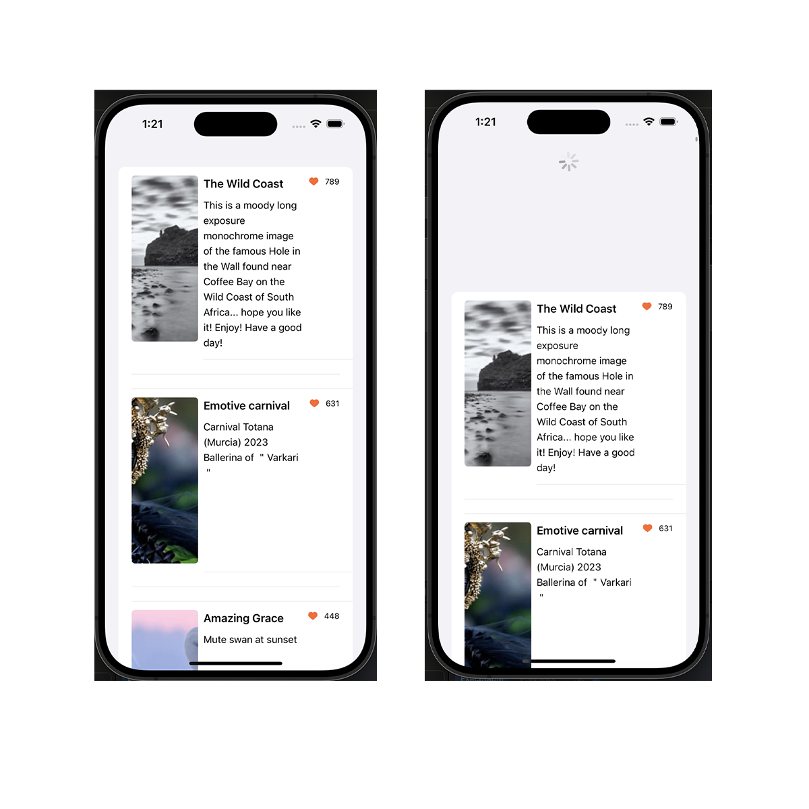

# lmwnjunior assginment
SwiftUI API call + pull refresh

## Contributing

In Code, we will only encounter LMWN's Assignments and practice our skills.

**Remark: Pull refresh first and then the data will be shown...**

**Remark 2: It takes a little time to load JSON data...**
